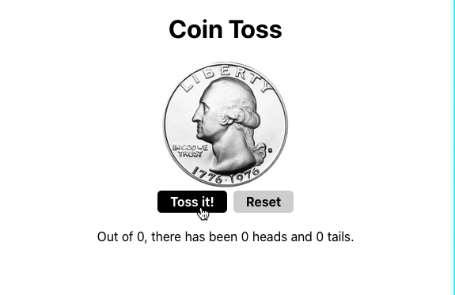

# React Coin Toss App

This was an exercise to give me more practice working with props, defaultProps, state, and simple click events in React. Also more experience setting state and binding event handlers. Really important stuff!

### The Goal

I am to create a coin flipping counter.

The user should be able to click on a button to flip a coin. Every time the user clicks, the coin gets flipped again. The app should also keep track of how many times heads and tails have shown up.

I need to break this app up into at least two separate components!

#### Here’s my inspiration:

## My Finished Project

I created the coin flipper counter with an additional CSS animation to add some personal flare. When pressing the "Toss It!" button a function is called to change the state of the app based on the random outcome of the coin selected. Every flip is counted as well as the side of the coin that is called. I also added a reset button to this app. 

This project uses React, JSX and CSS. It is built with only two React components.

:thumbsup: *Thanks for checking out my work on GitHub! For more about me find me on Twitter [@TyeDev](https://twitter.com/tyedev) or vist my personal website [TyeCampbell.com](www.TyeCampbell.com).*
